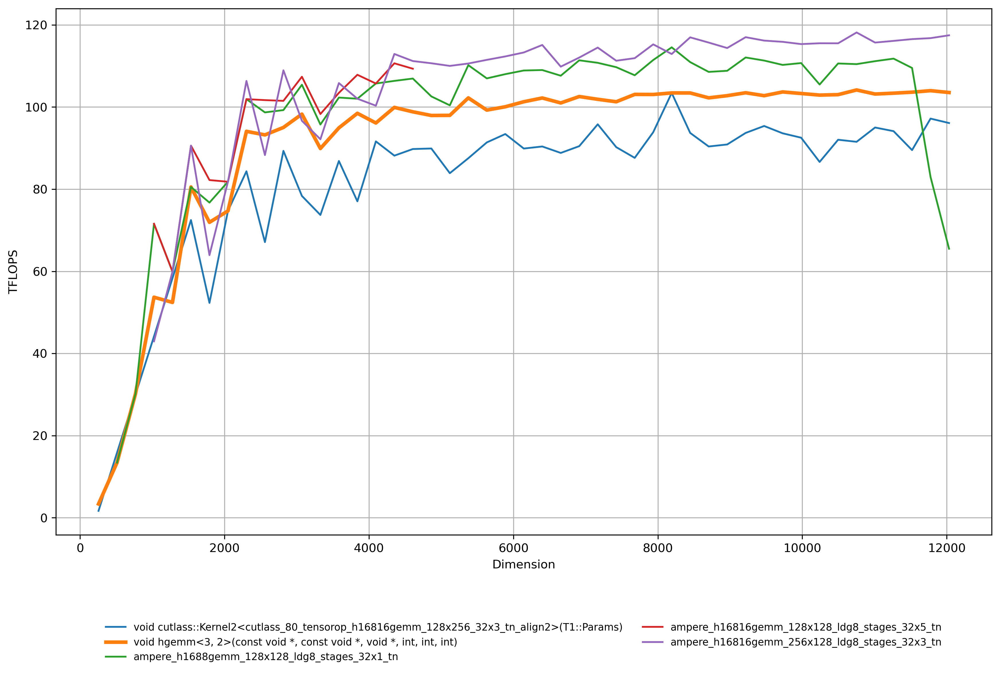
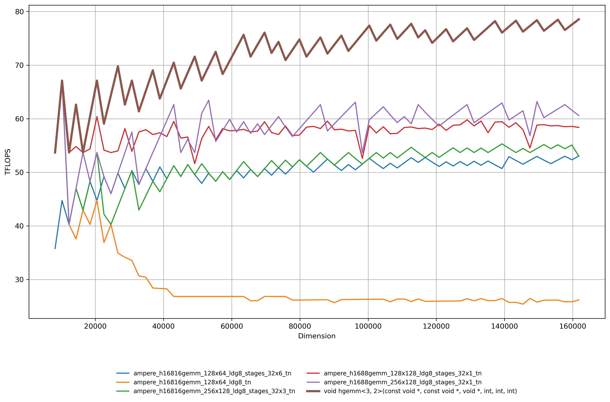

# CuTe-Gemm-Fp16

HGEMM for Ampere Architecture and above (sm>=80). The basic idea is the same with my [previous kernel](https://github.com/annp0/GEMM-FP16), but instead of using the WMMA API, I used CuTe templates. This allows us to XOR swizzle shared memory and reduce bank conflicts. I have also written an epilogue for this kernel where it first permutate output in shared memory so that we can use vectorized transfer back to global memory.

The benchmark was done on NVIDIA A6000. It outperforms some cutlass / cublasLt kernels on some cases.

| Case: M=N=K              | Case: Large M with N=K=256               |
|:--------------------------------:|:---------------------------------:|
|       |    |